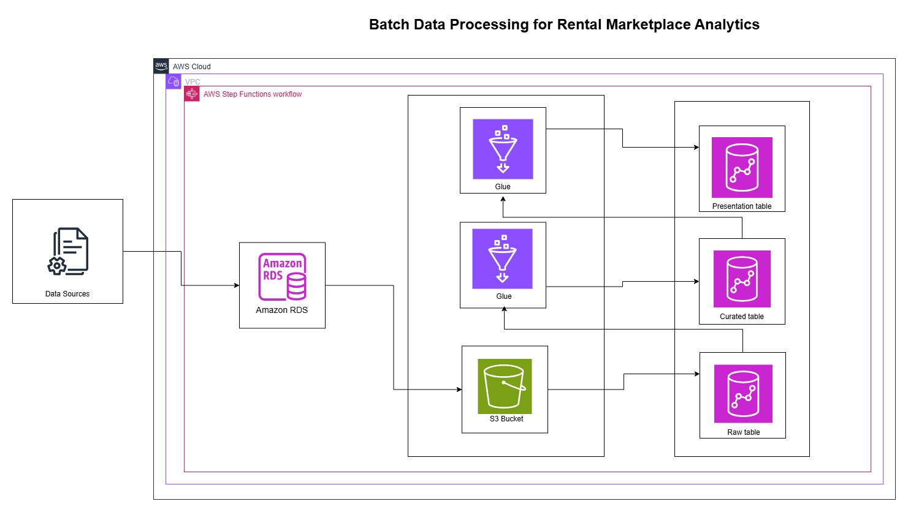
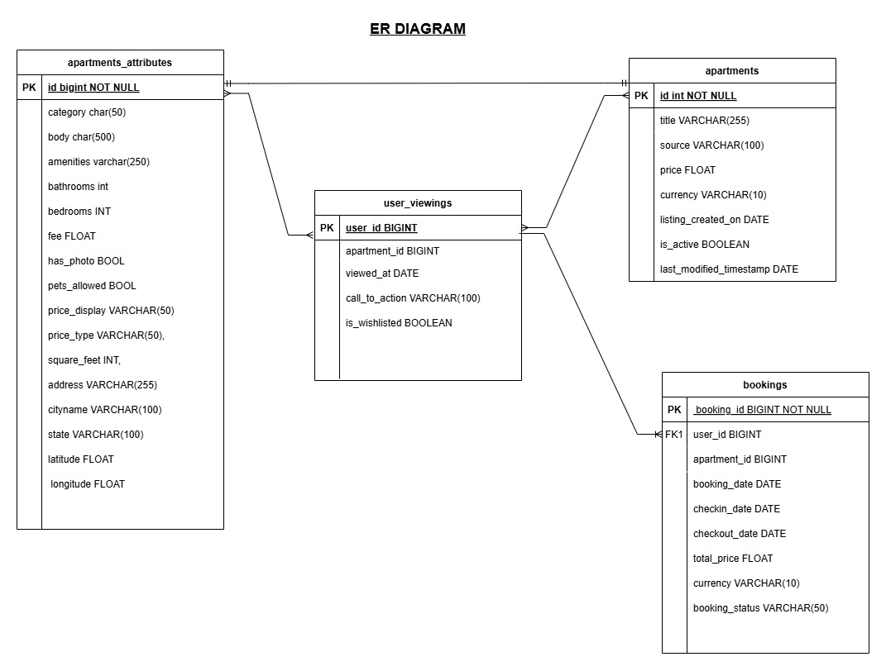

# Rental Marketplace

Overview
========

This project focuses on implementing an end-to-end data pipeline for a rental marketplace platform, similar to Airbnb. The pipeline extracts data from an AWS Aurora MySQL database, processes it, and loads it into an Amazon Redshift data warehouse. The platform's data includes rental listings and user interactions, enabling analytical reporting and business intelligence. The pipeline ensures data validation, transformation, and efficient loading into Redshift to support reporting and decision-making processes.

    

 
 ## 🔧 AWS Glue Python Shell Jobs
### **1️⃣ Extract & Load Job**
- Moves data from **RDS to S3** and **loads into Redshift Raw Layer**

### **2️⃣ Transform Job**
- Processes **S3 data** and loads into **Redshift Curated Schema**

### **3️⃣ KPI Computation Job**
- Computes **business metrics** from **S3 data** and stores in **Redshift Presentation**

## 🏗️ AWS Step Functions Workflow
1. **Start Execution**
2. **Run Extract & Load Job**
3. **Run Transform Job**
4. **Run KPI Calculation Job**
5. **Store Results in Redshift**
6. **End Execution**

    

## 📂 Datasets & Schema
### **1️⃣ Apartments Data**
| Column                | Type     | Description                   |
|----------------------|---------|-----------------------------|
| id                   | INT     | Unique apartment ID         |
| title                | STRING  | Apartment title             |
| source               | STRING  | Listing source              |
| price                | FLOAT   | Rental price                |
| currency             | STRING  | Currency type               |
| listing_created_on   | TIMESTAMP | Listing creation date   |
| is_active            | BOOL    | Active listing status       |
| last_modified_timestamp | TIMESTAMP | Last update timestamp |

### **2️⃣ Apartment Attributes**
| Column         | Type   | Description                   |
|--------------|-------|-----------------------------|
| id           | INT   | Apartment ID                |
| category     | STRING | Listing category           |
| body         | TEXT  | Description                |
| amenities    | TEXT  | Available amenities        |
| bathrooms    | INT   | Number of bathrooms       |
| bedrooms     | INT   | Number of bedrooms        |
| fee          | FLOAT | Additional fees            |
| has_photo    | BOOL  | Whether photos exist       |
| pets_allowed | STRING | Pet policy (nullable)    |
| price_display | STRING | Price display format    |
| price_type   | STRING | Pricing model            |
| square_feet  | INT   | Apartment size (sq ft)    |
| address      | STRING | Apartment address        |
| cityname     | STRING | City                     |
| state        | STRING | State                     |
| latitude     | FLOAT  | Latitude coordinate      |
| longitude    | FLOAT  | Longitude coordinate     |

### **3️⃣ User Viewings**
| Column         | Type     | Description                         |
|--------------|---------|---------------------------------|
| user_id      | INT     | User ID                          |
| apartment_id | INT     | Apartment ID                    |
| viewed_at    | TIMESTAMP | Viewing timestamp           |
| is_wishlisted | BOOL    | Whether user wishlisted       |
| call_to_action | STRING | Action taken after viewing  |

### **4️⃣ Bookings**
| Column        | Type     | Description                     |
|-------------|---------|-----------------------------|
| booking_id   | INT     | Unique booking ID         |
| user_id      | INT     | User ID                   |
| apartment_id | INT     | Apartment ID              |
| booking_date | TIMESTAMP | Date of booking       |
| checkin_date | TIMESTAMP | Check-in date         |
| checkout_date | TIMESTAMP | Check-out date       |
| total_price  | FLOAT   | Total booking cost       |
| currency     | STRING  | Payment currency        |
| booking_status | STRING | Booking status         |

