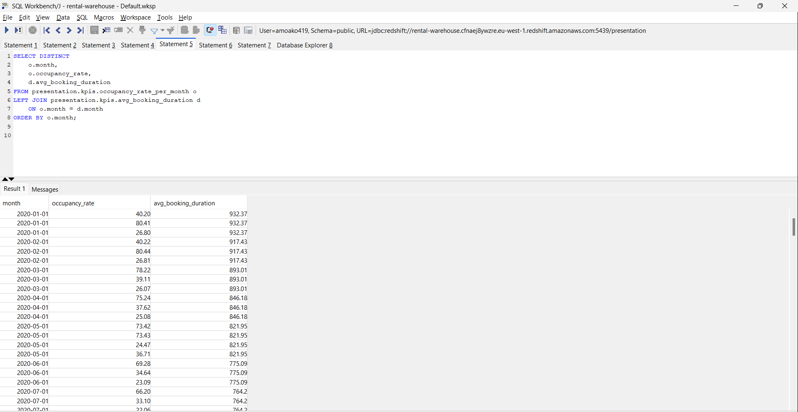
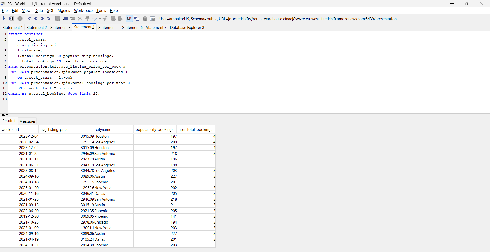

# Rental Marketplace

Overview
========

This project focuses on implementing an end-to-end data pipeline for a rental marketplace platform, similar to Airbnb. The pipeline extracts data from an AWS Aurora MySQL database, processes it, and loads it into an Amazon Redshift data warehouse. The platform's data includes rental listings and user interactions, enabling analytical reporting and business intelligence. The pipeline ensures data validation, transformation, and efficient loading into Redshift to support reporting and decision-making processes.

<p align="center">
    
</p>

## 🔧 AWS Glue Python Shell Jobs

### **1️⃣ Extract Job**
- Moves data from **RDS to S3** and **loads into Redshift Raw Layer**
- Script location: `glue_scripts/ingestion.py`

### **2️⃣ Transform Job**
- Processes **S3 data** and loads into **Redshift Curated Schema**
- Script location: `glue_scripts/transform.py`

### **3️⃣ Load and KPI Computation Job**
- Computes **business metrics** from **S3 data** and stores in **Redshift Presentation**
- Script location: `glue_scripts/loading.py`
## 🏗️ AWS Step Functions Workflow

<p align="center">
    
</p>

- **Script location**: `glue_scripts/step_functions.py`

1. **Start Execution**
2. **Run Extract & Load Job**
3. **Run Transform Job**
4. **Run KPI Calculation Job**
5. **Send Email**
6. **End Execution**


## 📂 Datasets & Schema

<p align="center">
    
</p>

### **1️⃣ Apartments Data**
| Column                | Type     | Description                   |
|----------------------|---------|-----------------------------|
| id                   | INT     | Unique apartment ID         |
| title                | STRING  | Apartment title             |
| source               | STRING  | Listing source              |
| price                | FLOAT   | Rental price                |
| currency             | STRING  | Currency type               |
| listing_created_on   | TIMESTAMP | Listing creation date   |
| is_active            | BOOL    | Active listing status       |
| last_modified_timestamp | TIMESTAMP | Last update timestamp |

### **2️⃣ Apartment Attributes**
| Column         | Type   | Description                   |
|--------------|-------|-----------------------------|
| id           | INT   | Apartment ID                |
| category     | STRING | Listing category           |
| body         | TEXT  | Description                |
| amenities    | TEXT  | Available amenities        |
| bathrooms    | INT   | Number of bathrooms       |
| bedrooms     | INT   | Number of bedrooms        |
| fee          | FLOAT | Additional fees            |
| has_photo    | BOOL  | Whether photos exist       |
| pets_allowed | STRING | Pet policy (nullable)    |
| price_display | STRING | Price display format    |
| price_type   | STRING | Pricing model            |
| square_feet  | INT   | Apartment size (sq ft)    |
| address      | STRING | Apartment address        |
| cityname     | STRING | City                     |
| state        | STRING | State                     |
| latitude     | FLOAT  | Latitude coordinate      |
| longitude    | FLOAT  | Longitude coordinate     |

### **3️⃣ User Viewings**
| Column         | Type     | Description                         |
|--------------|---------|---------------------------------|
| user_id      | INT     | User ID                          |
| apartment_id | INT     | Apartment ID                    |
| viewed_at    | TIMESTAMP | Viewing timestamp           |
| is_wishlisted | BOOL    | Whether user wishlisted       |
| call_to_action | STRING | Action taken after viewing  |

### **4️⃣ Bookings**
| Column        | Type     | Description                     |
|-------------|---------|-----------------------------|
| booking_id   | INT     | Unique booking ID         |
| user_id      | INT     | User ID                   |
| apartment_id | INT     | Apartment ID              |
| booking_date | TIMESTAMP | Date of booking       |
| checkin_date | TIMESTAMP | Check-in date         |
| checkout_date | TIMESTAMP | Check-out date       |
| total_price  | FLOAT   | Total booking cost       |
| currency     | STRING  | Payment currency        |
| booking_status | STRING | Booking status         |


## 📈 KPIs Created

### Rental Performance Metrics
- **Average Listing Price**:  
  Compute the average price of active rental listings each week.

- **Occupancy Rate**:  
  Measure the percentage of available rental nights that were booked over a month.

- **Most Popular Locations**:  
  Identify the most frequently booked cities every week.

- **Top Performing Listings**:  
  Track properties with the highest confirmed revenue per week.

### User Engagement Metrics
- **Total Bookings per User**:  
  Count the total number of rentals booked per user every week.

- **Average Booking Duration**:  
  Compute the mean duration of confirmed stays over time.

- **Repeat Customer Rate**:  
  Measure how many users book more than once within a rolling 30-day period.


## 📊 Monthly KPI Analysis

### SQL Query
The following query retrieves key performance indicators (KPIs) for monthly analysis:

<p align="center">
    
</p>

```sql
SELECT DISTINCT
    o.month,
    o.occupancy_rate,
    d.avg_booking_duration
FROM presentation.kpis.occupancy_rate_per_month o
LEFT JOIN presentation.kpis.avg_booking_duration d
    ON o.month = d.month
ORDER BY o.month;
```

### Explanation for the CEO (Monthly KPIs)

- **Occupancy Rate**:  
  This metric shows the percentage of available rental nights that were booked in a month, indicating how effectively our inventory is being utilized.

- **Average Booking Duration**:  
  By tracking the average length of stays, we gain insight into customer preferences and the potential revenue per booking.

### SQL Query
The following query retrieves key performance indicators (KPIs) for weekly analysis:

<p align="center">
    
</p>

```sql
SELECT DISTINCT
    a.week_start,
    a.avg_listing_price,
    l.cityname,
    l.total_bookings AS popular_city_bookings,
    u.total_bookings AS user_total_bookings
FROM presentation.kpis.avg_listing_price_per_week a
LEFT JOIN presentation.kpis.most_popular_locations l
    ON a.week_start = l.week
LEFT JOIN presentation.kpis.total_bookings_per_user u
    ON a.week_start = u.week
ORDER BY u.total_bookings DESC
LIMIT 20;
```

### Explanation for the CEO (Weekly KPIs)

- **Average Listing Price**:  
  We monitor the average rental price of active listings each week. This provides insight into market pricing trends.

- **Most Popular Location**:  
  For each week, we identify the city with the highest number of bookings. This helps us target marketing and adjust inventory for high-demand areas.

- **User Engagement**:  
  We also track the total number of bookings per user each week. Higher numbers indicate increased engagement and platform stickiness.

## 🧰 Technologies Used
- **AWS RDS MySQL**: Source database for rental marketplace data.
- **AWS S3**: Storage for raw and processed data.
- **AWS Redshift**: Data warehouse for analytical reporting.
- **AWS Glue**: ETL jobs for data extraction, transformation, and loading.
- **AWS Step Functions**: Orchestrates the pipeline workflow.
- **Python**: Scripting language for Glue jobs and data processing.