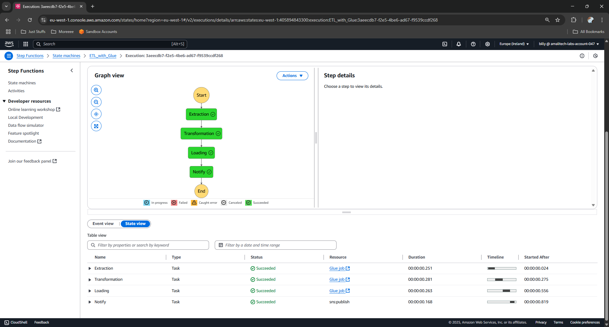

# Rental Marketplace

Overview
========

This project focuses on implementing an end-to-end data pipeline for a rental marketplace platform, similar to Airbnb. The pipeline extracts data from an AWS Aurora MySQL database, processes it, and loads it into an Amazon Redshift data warehouse. The platform's data includes rental listings and user interactions, enabling analytical reporting and business intelligence. The pipeline ensures data validation, transformation, and efficient loading into Redshift to support reporting and decision-making processes.

<p align="center">
    
</p>

## 🔧 AWS Glue Python Shell Jobs

### **1️⃣ Extract Job**
- Moves data from **RDS to S3** and **loads into Redshift Raw Layer**
- Script location: `glue_scripts/ingestion.py`

### **2️⃣ Transform Job**
- Processes **S3 data** and loads into **Redshift Curated Schema**
- Script location: `glue_scripts/transform.py`

### **3️⃣ Load and KPI Computation Job**
- Computes **business metrics** from **S3 data** and stores in **Redshift Presentation**
- Script location: `glue_scripts/loading.py`
## 🏗️ AWS Step Functions Workflow

<p align="center">
    
</p>

- **Script location**: `glue_scripts/step_functions.py`

1. **Start Execution**
2. **Run Extract & Load Job**
3. **Run Transform Job**
4. **Run KPI Calculation Job**
5. **Send Email**
6. **End Execution**


<p align="center">
    
</p>

## 📂 Datasets & Schema
### **1️⃣ Apartments Data**
| Column                | Type     | Description                   |
|----------------------|---------|-----------------------------|
| id                   | INT     | Unique apartment ID         |
| title                | STRING  | Apartment title             |
| source               | STRING  | Listing source              |
| price                | FLOAT   | Rental price                |
| currency             | STRING  | Currency type               |
| listing_created_on   | TIMESTAMP | Listing creation date   |
| is_active            | BOOL    | Active listing status       |
| last_modified_timestamp | TIMESTAMP | Last update timestamp |

### **2️⃣ Apartment Attributes**
| Column         | Type   | Description                   |
|--------------|-------|-----------------------------|
| id           | INT   | Apartment ID                |
| category     | STRING | Listing category           |
| body         | TEXT  | Description                |
| amenities    | TEXT  | Available amenities        |
| bathrooms    | INT   | Number of bathrooms       |
| bedrooms     | INT   | Number of bedrooms        |
| fee          | FLOAT | Additional fees            |
| has_photo    | BOOL  | Whether photos exist       |
| pets_allowed | STRING | Pet policy (nullable)    |
| price_display | STRING | Price display format    |
| price_type   | STRING | Pricing model            |
| square_feet  | INT   | Apartment size (sq ft)    |
| address      | STRING | Apartment address        |
| cityname     | STRING | City                     |
| state        | STRING | State                     |
| latitude     | FLOAT  | Latitude coordinate      |
| longitude    | FLOAT  | Longitude coordinate     |

### **3️⃣ User Viewings**
| Column         | Type     | Description                         |
|--------------|---------|---------------------------------|
| user_id      | INT     | User ID                          |
| apartment_id | INT     | Apartment ID                    |
| viewed_at    | TIMESTAMP | Viewing timestamp           |
| is_wishlisted | BOOL    | Whether user wishlisted       |
| call_to_action | STRING | Action taken after viewing  |

### **4️⃣ Bookings**
| Column        | Type     | Description                     |
|-------------|---------|-----------------------------|
| booking_id   | INT     | Unique booking ID         |
| user_id      | INT     | User ID                   |
| apartment_id | INT     | Apartment ID              |
| booking_date | TIMESTAMP | Date of booking       |
| checkin_date | TIMESTAMP | Check-in date         |
| checkout_date | TIMESTAMP | Check-out date       |
| total_price  | FLOAT   | Total booking cost       |
| currency     | STRING  | Payment currency        |
| booking_status | STRING | Booking status         |

## 🛠️ Prerequisites
- **AWS Account**: Ensure you have access to AWS services like Aurora, S3, Redshift, Glue, and Step Functions.
- **Python**: Install Python 3.8 or later.
- **AWS CLI**: Configure the AWS CLI with appropriate credentials.
- **IAM Roles**: Set up IAM roles with permissions for Glue, S3, and Redshift.

## 🚀 Setup Instructions
1. Clone the repository:
   ```bash
   git clone https://github.com/your-repo/rental-marketplace.git
   cd rental-marketplace
   ```
2. Install dependencies:
   ```bash
   pip install -r requirements.txt
   ```
3. Configure AWS resources:
   - Create an Aurora MySQL database and populate it with sample data.
   - Set up S3 buckets for raw and processed data.
   - Create a Redshift cluster and define schemas for raw, curated, and presentation layers.

4. Deploy Glue jobs:
   - Upload the Python scripts to S3.
   - Create Glue jobs for extraction, transformation, and KPI computation.

5. Configure Step Functions:
   - Define the workflow using the provided state machine definition.

6. Run the pipeline:
   - Trigger the Step Functions workflow to execute the pipeline.

## 🧰 Technologies Used
- **AWS Aurora MySQL**: Source database for rental marketplace data.
- **AWS S3**: Storage for raw and processed data.
- **AWS Redshift**: Data warehouse for analytical reporting.
- **AWS Glue**: ETL jobs for data extraction, transformation, and loading.
- **AWS Step Functions**: Orchestrates the pipeline workflow.
- **Python**: Scripting language for Glue jobs and data processing.

## 📈 Business Use Cases
- Analyze user interactions to identify popular listings.
- Compute KPIs such as average booking price, occupancy rates, and revenue trends.
- Generate reports for decision-making and strategy planning.

